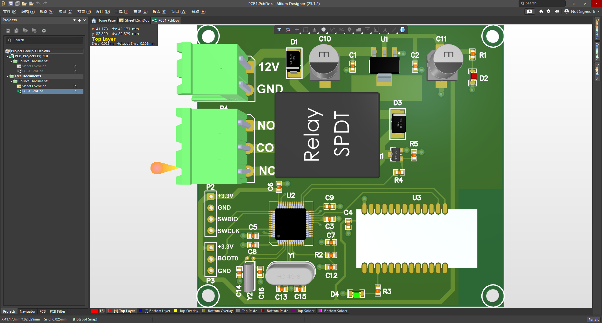
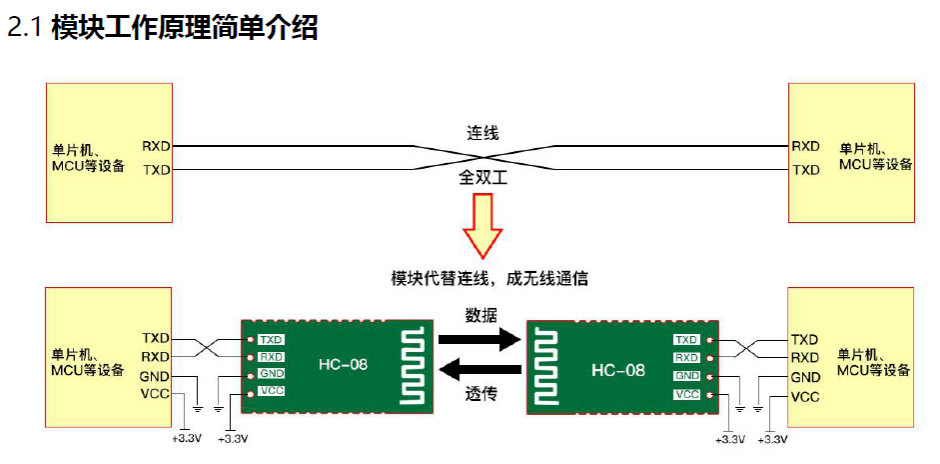
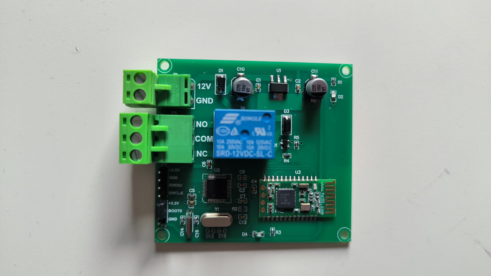

## Project Overview

This project features a wireless relay control module based on the STM32 microcontroller and the HC08 Bluetooth module. The design enables reliable Bluetooth communication to remotely control relays, making it ideal for smart home automation, IoT applications, and industrial control systems.



The PCB design includes carefully routed signal lines, power supply filtering, and robust relay driver circuitry to ensure stable operation under various loads. The HC08 module provides simple and energy-efficient Bluetooth connectivity compatible with a wide range of host devices.

---

## Programming and Debugging

Firmware development and debugging are performed using the Segger J-Link programmer/debugger. Follow these steps to upload and debug your code on the STM32 MCU:

1. **Connect J-Link to the Board:**  
   - Connect the J-Link debug probe to the STM32 SWD (Serial Wire Debug) interface on the PCB (usually pins SWDIO, SWCLK, GND, and optionally RESET).
   - Ensure proper power supply to the board.

2. **Prepare Firmware:**  
   - Compile your STM32 firmware project using your preferred IDE (e.g., STM32CubeIDE, Keil, IAR Embedded Workbench).
   - Generate a `.bin` or `.elf` file for flashing.

3. **Flash Firmware:**  
   - Use Segger’s J-Link Commander or integrated IDE programming tools.  
   - Example command to flash using J-Link Commander:

     ```
     JLink.exe
     connect
     device STM32Fxxx
     speed 4000
     loadfile path/to/firmware.bin
     reset
     exit
     ```

4. **Debugging:**  
   - Use J-Link’s debugging capabilities to set breakpoints, inspect registers, and step through code.
   - IDEs like STM32CubeIDE provide seamless integration with J-Link for advanced debugging features.

---


## Module Working Principle (HC-08 Wireless UART Bridge)

The diagram below illustrates how two microcontroller units (MCUs) communicate wirelessly using HC-08 Bluetooth modules, replacing traditional wired UART serial communication.

 

- **Traditional wired communication:**  
  Two MCUs communicate via UART lines — RXD (Receive Data) and TXD (Transmit Data) — with direct cross-wiring for full-duplex communication.

- **Wireless communication with HC-08 modules:**  
  Each MCU connects to an HC-08 Bluetooth module through UART lines (TXD, RXD), ground (GND), and power (VCC, typically 3.3V).  

- **Data transmission:**  
  The HC-08 modules establish a wireless serial bridge. Data transmitted from the MCU’s TXD pin is sent wirelessly by the first HC-08 module to the paired HC-08 module on the other side, which forwards it to the RXD pin of the second MCU, and vice versa.

- **Result:**  
  The wired UART connection is replaced with a transparent wireless UART link, preserving full-duplex serial communication without physical cables.

- **Advantages:**  
  - Eliminates the need for UART wiring between devices.  
  - Enables flexible device placement and mobility.  
  - Simplifies system wiring and installation.

---

## Hardware Components Description

This PCB integrates several key surface-mount components to implement the STM32 + HC08 Bluetooth relay control module:

- **STM32 Microcontroller (U2)**  
  The main controller chip responsible for relay control logic and Bluetooth communication. Typically a low-power ARM Cortex-M series MCU.

- **HC-08 Bluetooth Module (U3)**  
  Provides wireless serial communication via Bluetooth Low Energy (BLE), enabling remote control of the relay through UART interface.

- **Relay (SRD-12VDC-SL-C, Blue Component)**  
  A 12V coil relay capable of switching up to 10A at 250VAC or 30VDC, used to control external high-power loads.

- **Voltage Regulators and Power Filtering (U1, C1, C2, C10, C11, etc.)**  
  Ensure stable power supply and filter out electrical noise to protect sensitive components and ensure reliable operation.

- **Crystal Oscillator (Y1)**  
  Provides the clock signal necessary for the STM32 MCU to operate at the specified frequency.

- **Connectors (Green Terminal Blocks)**  
  Facilitate wiring connections for power input (12V, GND) and relay outputs: Normally Open (NO), Common (COM), and Normally Closed (NC).

- **Programming Interface Pins (SWDIO, SWCLK, GND, BOOT0)**  
  Used for firmware flashing and debugging via external programmers such as Segger J-Link.

- **Passive Components (Resistors R1-R5, Capacitors C3-C16, Diodes D1-D4)**  
  Employed for signal conditioning, voltage protection, current limiting, and noise suppression.
 
---
